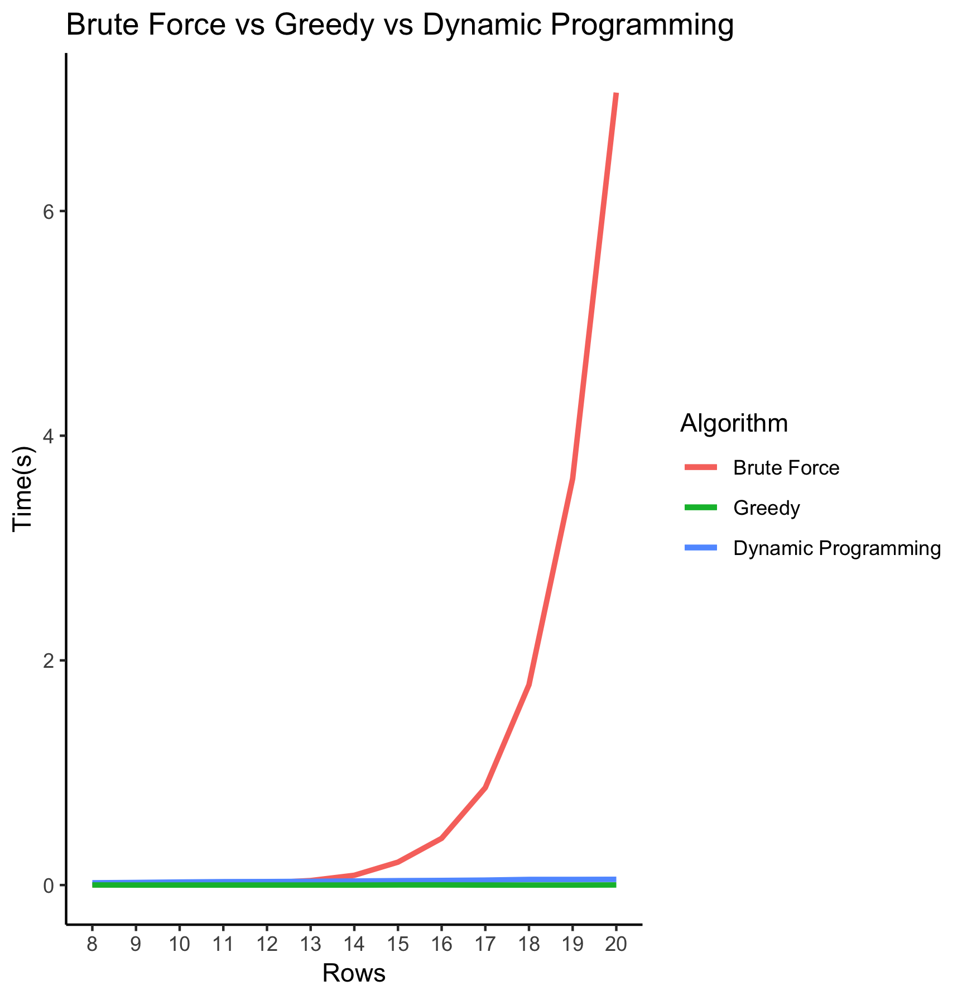
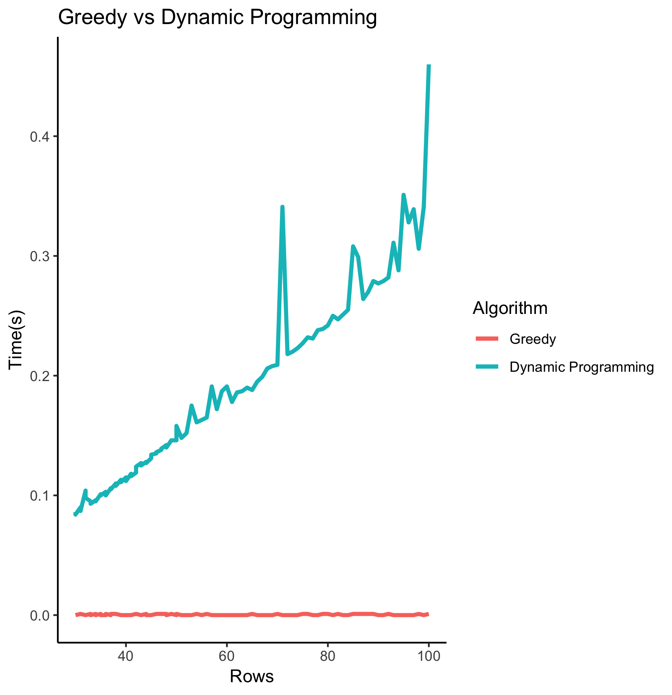

```{r setup, include = FALSE}
knitr::opts_chunk$set(
  collapse = TRUE,
  comment = "#>"
)
```

## Introduction
This package contains three different functions for solving the [knapsack problem](https://en.wikipedia.org/wiki/Knapsack problem). These three functions implement knapasck problem by different algorithm.

1. Brute force search
2. Dynamic programming
3. Greedy heuristic

**Installation**
```{r, eval=FALSE, message=FALSE, warning=FALSE}
devtools::install_github('yusur/Rlab06', build_vignettes = TRUE)
```


## Brute force search
This function going through all possible alternatives and return the maximum value found. This approach is of complexity O(2n) since all possible combinations 2n needs to be evaluated.

```{r, eval = FALSE}
data("knapsack_objects")
brute_force_knapsack(x = knapsack_objects[1:8,], W = 3500)

# $value
# [1] 16770
# $elements
# [1] 5 8
```

**Question: ** How much time does it takes to run the algorithm for n = 16 objects?
```{r, eval = FALSE}
system.time(brute_force_knapsack(x = knapsack_objects[1:16, ], W = 3500))

#  user  system elapsed 
# 0.393   0.043   0.440
```


**Parallelize**
```{r, eval = FALSE}
system.time(brute_force_knapsack(x = knapsack_objects[1:16, ], W = 3500, parallel = TRUE))

#  user  system elapsed 
# 0.506   0.300   0.283 
```

With parameter `parallel = TRUE`, the function will parallelize over the detected cores.


## Dynamic programming
Use dynamic programming to save all result in a matrix. The pseudocode for this algorithm can be found [here](https://en.wikipedia.org/wiki/Knapsack problem#0.2F1 knapsack problem) This function returns the same results as the brute force search, but the time complexity reduce to O(Wn).

```{r, eval = FALSE}
knapsack_dynamic(x = knapsack_objects[1:8,], W = 3500)

# $value
# [1] 16770
# $elements
# [1] 5 8

system.time(knapsack_dynamic(x = knapsack_objects[1:16,], W = 3500))

#  user  system elapsed 
# 0.041   0.000   0.041 
```
As you can see, comparing two functions, the running time reduces from 0.440s to 0.041s.

**Question: **How much time does it takes to run the algorithm for n = 500 objects?
```{r, eval = FALSE}
system.time(knapsack_dynamic(x = knapsack_objects[1:500,], W = 3500))

#  user  system elapsed 
# 1.577   0.041   1.634
```

## Greedy heuristic

```{r, eval = FALSE}
greedy_knapsack(x = knapsack_objects[1:800,], W = 3500)

# $value
# [1] 192646.7
# 
# $elements
#  [1]  35  37  43  55  77  80  92 110 117 229 234 243 255 282 288 290 300 303 332 345 346 436 472 500 537 564
# [27] 574 577 599 719 747 764 776 794
```


**Question: **How much time does it takes to run the algorithm for n = 1000000 objects?


## Running Time comparison

```{r, eval = FALSE}
run_time <- data.frame()
for (i in 8:20) {
  print (i)
  run_time <- rbind(run_time, 
  data.frame(rows = i,
    brute_force_knapsack = 
      system.time(brute_force_knapsack(x = knapsack_objects[1:i,], W = 3500))[3],
    knapsack_dynamic = 
      system.time(knapsack_dynamic(x = knapsack_objects[1:i,], W = 3500))[3],
    greedy_knapsack = 
      system.time(greedy_knapsack(x = knapsack_objects[1:i,], W = 3500))[3])
  )
}

# run_time
           # rows brute_force_knapsack knapsack_dynamic greedy_knapsack
# elapsed      8                0.001            0.020           0.001
# elapsed1     9                0.003            0.023           0.000
# elapsed2    10                0.006            0.027           0.000
# elapsed3    11                0.009            0.030           0.000
# elapsed4    12                0.020            0.031           0.000
# elapsed5    13                0.040            0.033           0.000
# elapsed6    14                0.087            0.036           0.000
# elapsed7    15                0.204            0.039           0.001
# elapsed8    16                0.416            0.041           0.001
# elapsed9    17                0.867            0.044           0.000
# elapsed10   18                1.783            0.050           0.000
# elapsed11   19                3.618            0.050           0.000
# elapsed12   20                7.054            0.051           0.001
```


**3 algorithm comparison**

{width=500px}

**2 algorithm comparison**

{width=500px}


## Questions


**1.1.6 What performance gain could you get by trying to improving your code?**

